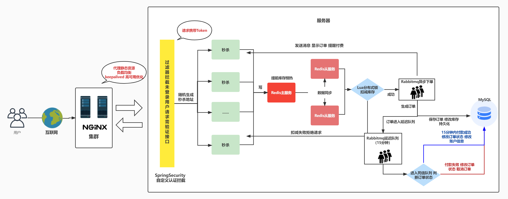
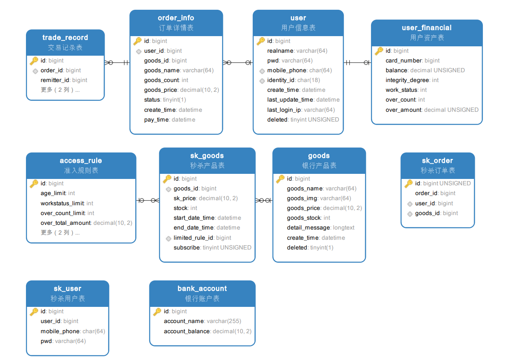
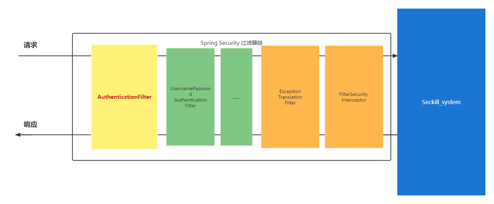

# seckill-system 秒杀系统
seckill-system 是一个前后端分离的银行产品秒杀系统，采用当下热门的秒杀方案，灵活应对高并发、高可用秒杀场景。
该项目为秒杀系统的后端，可以通过下图快速了解项目大体框架以及所使用的相关技术。

该项目后台后端管理项目地址：[......]()

## 技术栈
- JDK 11
- Maven 4.0+
- Spring Boot 2.3.9.RELEASE
- Spring Security + JWT
- MySQL 8.0+
- Redis 5.0+
- MyBatis-plus
- Rabbitmq 2.6+

##### swagger3

该项目已配置 swagger3，运行后可在线查看接口文档并调试接口。
[swagger 在线接口文档](http://localhost/swagger-ui/index.html#/)
因为项目配置认证拦截，即使在 swagger 中，需要通过登录接口进行登录获取 token。并在之后的请求头中加入 `token` 才能正常调试接口。
> hint: 如果使用 Google 浏览器，建议下载插件 [ModHeader](https://modheader.com/) ，便捷地在请求头中加入 token

## 项目部署

秒杀系统对应的后端模块为 seckillsystem

### 数据库配置

数据库初始文件在源码根目录的sql文件夹下

[数据库初始文件](sql/seckill_system.sql)

### 修改 application.yml 配置文件

修改Mysql数据库，Rabbitmq，Redis的host和账号密码为本地的环境。

## 项目功能描述
### 1. 用户认证
- 在项目中注入了 SpringSecurity 结合 jwt 实现 Token 无状态登录，并且自定义 AuthanticationFilter 拦截器保护认证接口，当未登录用户访问我们需要认证的接口如秒杀、获取用户个人信息等接口时会在最前端进行拦截。

### 2. 缓存预热

项目启动时，将数据库的商品库存存储到 redis 中。同时，在本地缓存中记录商品是否卖完的信息。

### 3. 秒杀业务

#### 3.1 判断商品是否已经卖完

本地缓存中记录了商品是否卖完的信息。

> 优化内容：数据库查询商品库存 -> 本地缓存中查询

#### 3.2 判断用户是否重复秒杀某一商品

用户秒杀成功某商品后，会将信息存储到 redis 中。同时在数据库中建立用户ID与商品ID的唯一索引，确保用户不会重复购买同一商品。

> 优化内容：从数据中根据用户ID查询商品ID -> redis 中查询

#### 3.3 预减库存

用户秒杀商品，先预减库存。库存不足，则秒杀失败。库存减为0时，则记录该商品已经卖完。（见 3.2）

> 优化内容：数据库中查询商品库存 -> redis 中预减库存

#### 3.4 将秒杀信息放入Rabbitmq消息队列中

通过消息队列实现异步下单与流量削峰。

#### 3.5 消费消息

##### 3.5.1 扣减商品库存

扣减数据库的商品库存

##### 3.5.2 生成订单

在数据库生成商品订单

##### 3.5.3 将秒杀成功的用户ID与商品ID保存到redis中

#### 3.6 秒杀失败

在 3.6 中任一过程出问题时，数据将会回滚，redis 中预减的库存会加回来。

#### 3.7 隐藏秒杀地址

用户请求秒杀接口时，会先根据用户消息和产品ID生成一个随机地址，真正的秒杀接口被隐藏

### 4. 订单管理

#### 4.1 延迟队列支付订单
传统的支付机制为对数据库访问次数多，对服务器性能要求较大，难以应对大量支付请求同时发起和堆积的场景。首先，秒杀系统将支付信息加入订单消息队列异步处理，这里的优化与秒杀一致。
当应对用户下单后长时间未支付订单堆积的场景时，我们通过 Rabbitmq 实现消息延迟和死信队列，设置15分钟内未支付则订单自动取消，减小服务器的压力，促进用户消费。

### 5. 系统测试

| 序号 | 场景                                     | 备注 |
|:----:| ---------------------------------------- | ---- |
|  0   | 秒杀业务常规流程                         |      |
|  1   | 未登录用户访问界面                       |      |
|  2   | 不符合准入条件用户参与秒杀               |      |
|  3   | 多用户同时参与秒杀                       |      |
|  4   | 高并发量下，单用户多次重复请求           |      |
|  5   | 恶意脚本访问（多次重复请求、ip频繁请求） |      |

## 修订日志
#### 20220506
1. 消除魔法值
2. 支付业务解耦
3. 异常设计处理
4. 规范命名
5. 参照阿里巴巴泰山版 Java 开发手册规范代码